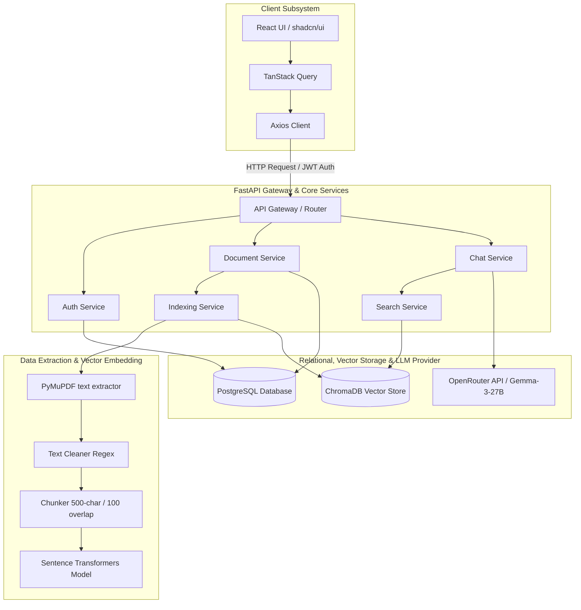

# KnowledgeForge Lite 🚀

[](https://github.com/Tanishq-lab/knowledgeforge-lite)
[](https://knowledgeforge-lite-sandy.vercel.app)
[](https://fastapi.tiangolo.com/)
[](https://www.trychroma.com/)
[](https://www.postgresql.org/)
[](https://github.com/Tanishq-lab/knowledgeforge-lite/blob/main/LICENSE)

**KnowledgeForge Lite** is a high-performance, production-ready, multi-tenant Retrieval-Augmented Generation (RAG) platform. It allows users to securely upload PDF documents, automatically index and embed text chunks, and hold context-aware conversations powered by state-of-the-art Large Language Models (LLMs). 

The platform features a modern, responsive React + TypeScript frontend styled with Tailwind CSS v4 and a robust, scalable FastAPI backend connected to PostgreSQL and a persistent ChromaDB vector store.

---

## 🏗️ System Architecture

KnowledgeForge Lite is designed using a decoupled, microservices-adjacent architecture separating document extraction, vector indexing, relational storage, and context-aware LLM query generation.



---

## ⚡ Key Features

1. **Secure Multi-Tenancy**: Complete tenant isolation. Relational metadata is stored in PostgreSQL, and vector documents are filtered at query-time via tenancy metadata (`owner_id`) in ChromaDB.
2. **Automated Data Extraction & Cleaning Pipeline**: 
   * **Parsing**: Extracts text using PyMuPDF (`fitz`).
   * **Regex Cleaning**: Normalizes line endings, collapses redundant blank lines and spaces, and cleans out page numbers (e.g., `1 / 10`) to eliminate vector noise.
   * **Chunking**: Applies character-based sliding-window chunking (default: `500` characters, `100` overlap) to retain contextual links between contiguous blocks.
3. **Local Vector Search System**: Embeddings are computed locally using Hugging Face's `all-MiniLM-L6-v2` transformer and stored in a persistent `ChromaDB` client, keeping storage low-cost and secure.
4. **Context-Aware Chat & Retrieval**: Combines semantic search hits with custom system prompts to instruct the LLM to answer *only* using retrieved document contexts, preventing hallucinations.
5. **Modern Single-Page UI**: Provides a clean Dashboard, document upload queue, document list, dynamic markdown Chat interface with sources, account settings, and support for Light/Dark mode.

---

## 🛠️ Technology Stack

KnowledgeForge Lite utilizes modern, industry-standard libraries designed for high-performance and developer productivity:

### Backend
* **Web Framework**: FastAPI (Asynchronous Python 3, automatic OpenAPI docs generation)
* **Relational Database**: PostgreSQL (Structured storage for user credentials and document metadata)
* **ORM & Migrations**: SQLAlchemy 2.0 (Declarative mapping) & Alembic (Database versioning)
* **Vector Store**: ChromaDB (High-efficiency local persistent vector database)
* **Embedding Model**: Sentence-Transformers (`all-MiniLM-L6-v2` - 384-dimensional dense vectors)
* **LLM Orchestration**: Direct API client wrapper communicating with OpenRouter (using `google/gemma-3-27b-it`)
* **Security & Auth**: PyJWT + Passlib (bcrypt hashing) for JWT-based auth tokens

### Frontend
* **Core**: React 19 (Functional components, hooks) & TypeScript (Type-safe builds)
* **Build System**: Vite 8 (Hot Module Replacement)
* **Styling**: Tailwind CSS v4 & Lucide React icons
* **Design Components**: shadcn/ui & Radix UI primitives
* **State Management & Caching**: `@tanstack/react-query` v5 (React Query)
* **Form Logic**: React Hook Form + Zod validation
* **Navigation**: React Router DOM v7
* **Markdown Renderer**: React Markdown + Remark GFM (For displaying chat answers and tables)

---

## 💾 Relational Database Schema

```
                  +-------------------+
                  |       users       |
                  +-------------------+
                  | id (PK)           | <----+
                  | username          |      |
                  | email (Unique)    |      | (1-to-Many Owner relationship)
                  | hashed_password   |      |
                  | created_at        |      |
                  +-------------------+      |
                            |                |
                            v                |
                  +-------------------+      |
                  |     documents     |      |
                  +-------------------+      |
                  | id (PK)           |      |
                  | original_filename |      |
                  | file_path         |      |
                  | owner_id (FK)     | -----+
                  | created_at        |
                  +-------------------+
```

---

## 🚀 Installation & Local Setup

### Prerequisites
* **Python**: `3.10` or higher
* **Node.js**: `18.x` or higher
* **PostgreSQL**: Local or cloud-hosted instance (e.g., Supabase or Railway)

### 1. Backend Setup
1. Clone the repository and navigate to the backend folder:
   ```bash
   git clone https://github.com/Tanishq-lab/knowledgeforge-lite.git
   cd knowledgeforge-lite/backend
   ```
2. Create and activate a Python virtual environment:
   ```bash
   python -m venv .venv
   # Windows Activation
   .venv\Scripts\activate
   # macOS/Linux Activation
   source .venv/bin/activate
   ```
3. Install required packages:
   ```bash
   pip install -r requirements.txt
   ```
4. Create a `.env` file based on the environment template (refer to section below) and update it with your DB connection string and LLM keys.
5. Execute database migrations using Alembic:
   ```bash
   alembic upgrade head
   ```
6. Spin up the FastAPI server:
   ```bash
   uvicorn app.main:app --reload
   ```
   The backend will be running at [http://localhost:8000](http://localhost:8000). The interactive API docs are available at [http://localhost:8000/docs](http://localhost:8000/docs).

### 2. Frontend Setup
1. Open a new terminal and navigate to the frontend folder:
   ```bash
   cd frontend
   ```
2. Install dependencies:
   ```bash
   npm install
   ```
3. Run the Vite development server:
   ```bash
   npm run dev
   ```
   The frontend will be running at [http://localhost:5173](http://localhost:5173).

---

## 📄 Environment Variable References

### Backend Environment Variables (`backend/.env`)

```ini
APP_NAME=KnowledgeForge Lite
APP_VERSION=1.0.0
DEBUG=False

# Relational Database Connection
DATABASE_URL=postgresql://<username>:<password>@<host>:<port>/<db_name>

# JWT Authentication Config
SECRET_KEY=your_secure_random_hex_key
ALGORITHM=HS256
ACCESS_TOKEN_EXPIRE_MINUTES=1440

# Vector Embeddings Configurations
EMBEDDING_MODEL=sentence-transformers/all-MiniLM-L6-v2

# LLM Providers (OpenAI-compatible / OpenRouter)
LLM_API_KEY=your_llm_provider_key
LLM_BASE_URL=https://openrouter.ai/api/v1
LLM_MODEL=google/gemma-3-27b-it
```

---

## 🔌 API Reference Specifications

| Route | HTTP Method | Auth Required | Description | Request Body / Parameters |
|:---|:---:|:---:|:---|:---|
| `/` | `GET` | ❌ | Health checks standard confirmation | N/A |
| `/auth/register` | `POST` | ❌ | Registers a new user account | `{username, email, password}` |
| `/auth/login` | `POST` | ❌ | Logs in user and returns JWT token | `{username/email, password}` |
| `/documents` | `GET` |  | Fetches all documents uploaded by the user | N/A |
| `/documents/upload`| `POST` |  | Uploads and parses a PDF document | Multipart Form: `file` (application/pdf) |
| `/documents/{id}` | `DELETE` |  | Deletes document metadata and Chroma chunks | Path: `id` |
| `/chat` | `POST` |  | Submits query context and gets response | `{question: str, document_ids: list[int]}` |

---

## 🎯 ATS Optimization & Key Core Competencies

For recruiters and hiring managers scanning this repository, here is a list of major software engineering themes and keywords implemented:

* **Retrieval-Augmented Generation (RAG)**: Developed an end-to-end question-answering workflow with semantic chunk retrieval.
* **Vector Search Database Operations**: Built indices, managed metadata tagging, and created scoped tenancy filters with **ChromaDB**.
* **Text Processing Pipelines**: Implemented data ingestion routines using PyMuPDF, custom overlap partitioning, and regex-based normalization filters.
* **Secured REST API Design**: Designed clean, route-separated **FastAPI** routers incorporating dependency injection, error middlewares, and JWT-authenticated route guards.
* **Modern Frontend UI Architecture**: Used React 19, custom custom hooks, component styling via Tailwind CSS v4, dynamic styling hooks using shadcn, and asynchronous query-caching mechanisms via **TanStack React Query**.
* **Relational Database Design**: Programmed declarative relationships in **SQLAlchemy 2.0** and automated migrations using **Alembic**.

---

## 📜 License

Distributed under the MIT License. See [LICENSE](https://github.com/Tanishq-lab/knowledgeforge-lite/blob/main/LICENSE) for more information.
